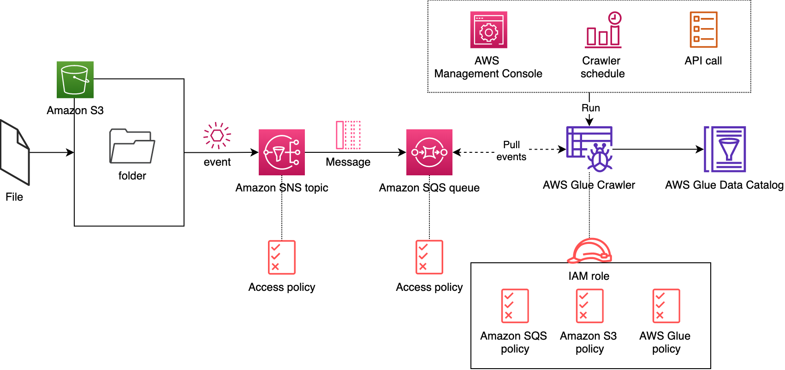

# Terraform ETL Project



## Overview
This Terraform ETL (Extract, Transform, Load) project sets up a serverless data processing pipeline on AWS. The infrastructure as code approach allows for reproducible and scalable deployments. The pipeline is designed to process data files, utilizing AWS services such as S3, SNS, SQS, and Glue.

### Architecture
The included diagram illustrates the flow of data and interactions between services:

1. **Data Ingestion**: Files are uploaded to an Amazon S3 bucket, triggering an event notification.
2. **Event Notification**: The S3 event is published to an SNS topic.
3. **Message Queuing**: The SNS topic forwards the message to an SQS queue.
4. **Data Processing**: The AWS Glue crawler is triggered by events in the SQS queue to classify and register data in the AWS Glue Data Catalog.
5. **Data Cataloging**: The cataloged metadata is made available in the AWS Glue Data Catalog for querying and further analysis.

## Project Structure
The project is organized into Terraform files and modules, each responsible for a segment of the AWS infrastructure:

- `*.tf`: Terraform files in the root directory set up providers and overarching resources.
- `modules/`: Contains submodules for each component of the infrastructure such as the S3 buckets, SNS topics, SQS queues, and AWS Glue resources.
- `policies/`: Templates for IAM policies necessary for the correct operation of the services.

## How to Use

### Prerequisites
- AWS Account
- Terraform installed on your machine

### Deployment
1. **Initialize Terraform** :

```sh
   terraform init
```
2. **Plan the Deployment** :
```sh
   terraform plan
```
3. **Apply the Configuration:**:
```sh
   terraform apply
```

